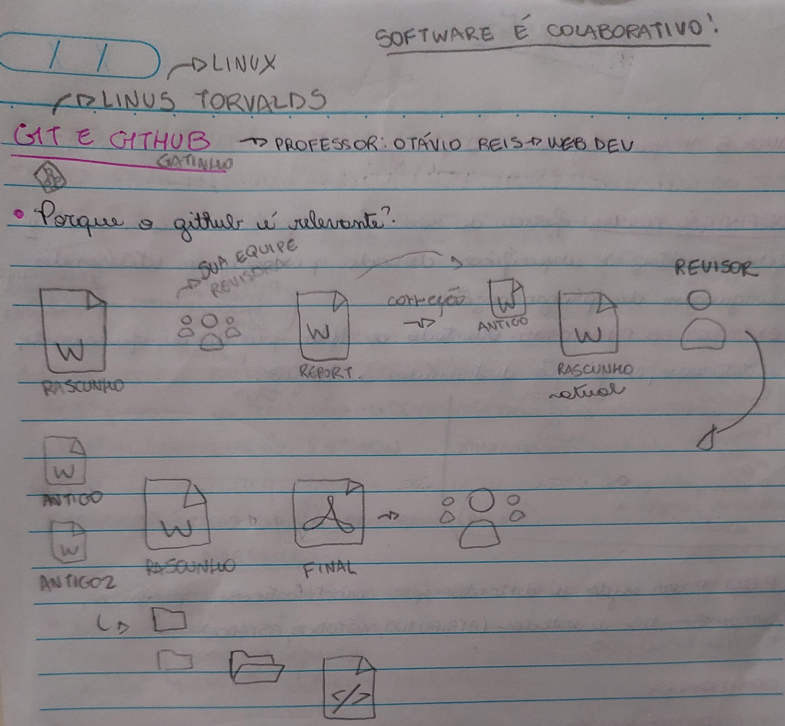
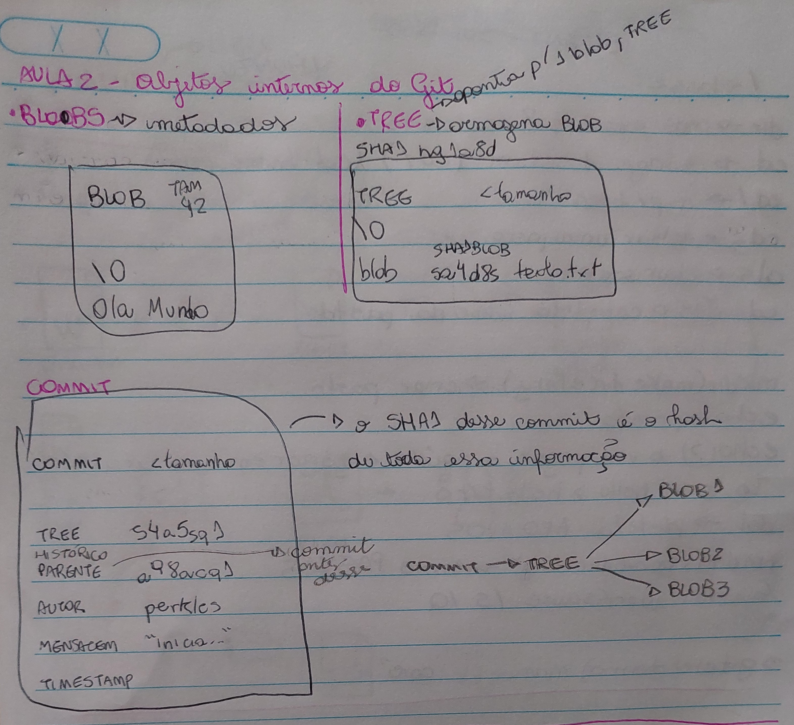
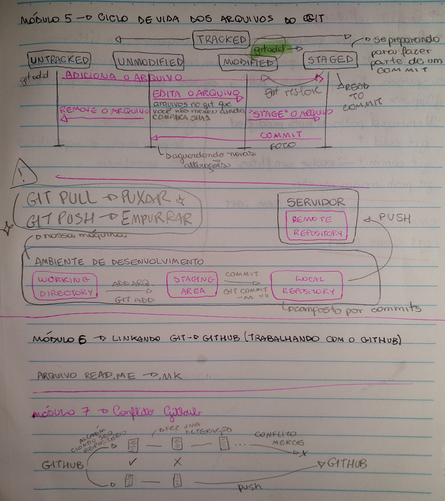

Dicas formatação Markdown : https://docs.pipz.com/central-de-ajuda/learning-center/guia-basico-de-markdown#open

O GitBash é um terminal extendido para otimizar o uso
do Git.

# Git e GitHub

_Github é muito utilizado porque possibilita o controle de versões, ou seja pessoas e lugares diferentes pelo mundo conseguem trabalhar no mesmo repositório, modificando os mesmos arquivos e juntos criando projetos._

_Pense no Git Hub como um repórter que escreve um rascunho de uma reportagem e passa para sua equipe revizadora. Eles fazem alguns ajustes e mandam novamente para ele. Ele então pega o 1º rascunho que escreveu e transforma em "Antigo" e fica com dois documentos, um antigo e um rascunho atual. Ele entrega o rascunho atual para um outro revisor. Logo, ele fica com Antigo1, Antigo2 e Rascunho Atual. O GitHub possibilita justamente controle de todas as versões._

**Benefícios:**
- controle de versão;
- armazenamento em nuvem;
- trabalho minha equipe;
- melhorar seu código;
- reconhecimento.

-> navegação via linha de comando

**Sha1 - > Secure Hash Algorithm:** Gera um arquivo de 40 CHAR que serve como "RG" de um documento;
-> maneira segura e encriptada de conectar 2 máquinas -> vamos dizer ao GitHub que nossa maquina é segura 

- chave pública x chave privada

